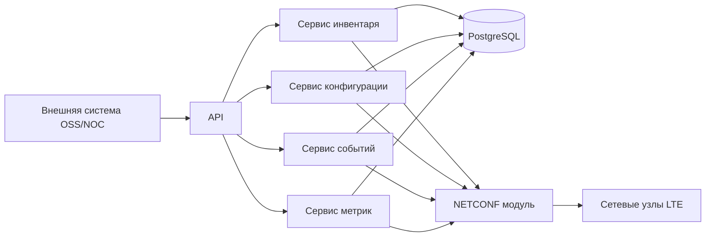

# Архитектура минимальной системы управления LTE (MVP)

Этот документ описывает простую учебную минимальную версию системы на Go. Цель: сделать рабочую основу, которую можно спокойно развивать дальше.

## 1. Что входит в MVP

В MVP делаем только базовые функции:

- подключение сетевых узлов по `NETCONF`;
- хранение состояния подключений;
- чтение инвентаря сети (основные LTE объекты);
- одно безопасное изменение конфигурации;
- прием базовых событий и heartbeat;
- простой API для внешней системы.

Минимальный набор LTE объектов в MVP:
`ENBFunction`, `EUtranCellFDD`, `EUtranCellTDD`, `EUtranFrequency`, `EUtranRelation`, `ExternalENBFunction`.

## 2. Что не делаем в MVP

Эти задачи переносим на следующий этап:

- сложные массовые изменения по большой группе узлов;
- расширенную аналитику и прогнозирование;
- сложные правила политики сети;
- глубокую поддержку вендорно-ориентированных конфигураций по всем функциям.

## 3. Простая схема сервисов

## 4. Как работают основные сценарии

### 4.1 Первичное подключение узла

1. В API передают параметры узла.
2. `NETCONF` модуль подключается и читает возможности узла.
3. Сервис инвентаря запрашивает основные объекты сети.
4. Снимок данных сохраняется в базу.

### 4.2 Изменение конфигурации

1. В API приходит запрос на изменение.
2. Сервис конфигурации выполняет шаги: `lock -> edit-config -> validate -> commit -> unlock`.
3. Результат и журнал изменения сохраняются.

### 4.3 События и heartbeat

1. Система принимает события от узла.
2. Если подписка на события пропала, система переходит на периодическую проверку heartbeat.
3. Текущее состояние узла отдается через API.

## 5. Какие спецификации читать и зачем

### Основные LTE и NRM спецификации

- `docs/specs/28658-j00.pdf` (TS 28.658): описание LTE объектов и связей между ними.
- `docs/specs/28622-j60.pdf` (TS 28.622): общая модель объектов управления.
- `docs/specs/28623-j60/28623-j60.pdf` (TS 28.623): правила представления модели.

### Что добавляет `docs/specs/28659-j00.pdf` (TS 28.659)

TS 28.659 — это описание **наборов решений (Solution Set)** для E-UTRAN NRM:

- CORBA представление;
- XML представление;
- правила записи Distinguished Name;
- правила сопоставления классов объектов.

Для нашего MVP на `NETCONF` это не основной рабочий протокол, но этот документ полезен как справочник:

- как правильно именовать объекты;
- как сверять соответствие между информационной моделью и форматами обмена;
- как подготовиться к пакетному обмену XML на следующем этапе.

### Спецификации по функциям

- `docs/specs/28510-j00.pdf`: требования к управлению конфигурацией.
- `docs/specs/28545-h00.pdf`: контроль аварий и событий.
- `docs/specs/28550-j20.pdf`, `docs/specs/32401-j00.pdf`: метрики и производительность.
- `docs/specs/32158-j10.pdf`, `docs/specs/32160-j50.pdf`: правила построения API.

## 6. Минимальный стек на Go

- Go `1.22+`
- `net/http` + `chi`
- библиотека `NETCONF` + `SSH`
- PostgreSQL + `pgx`
- миграции `golang-migrate`
- логи `zap`
- метрики Prometheus

## 7. Минимальная структура данных

- `network_elements` — список узлов;
- `ne_capabilities` — возможности узлов;
- `inventory_objects` — объекты инвентаря;
- `inventory_snapshots` — снимки состояния;
- `cm_requests` — запросы на изменение;
- `cm_audit` — журнал изменений;
- `fault_events` — события;
- `heartbeats` — heartbeat состояние;
- `pm_samples` — простые метрики.

## 8. Что делаем после MVP

После успешного MVP расширяем систему:

- пакетные изменения на группы узлов;
- расширенные метрики и агрегирование;
- сложная корреляция событий;
- поддержка пакетного XML обмена на базе TS 28.659;
- подключение аналитики (MDA).

## 9. Короткий словарь терминов

- `MVP` — минимально рабочая версия, с которой можно начать пилот и дальше развивать продукт.
- `API` — программный интерфейс, через который внешняя система работает с сервисом.
- `NETCONF` — сетевой протокол для чтения и изменения конфигурации узлов.
- `Inventory` (инвентарь) — список объектов сети и их текущих параметров.
- `CM` — управление конфигурацией (изменение параметров узлов).
- `PM` — сбор метрик производительности.
- `Fault` — аварийные события и предупреждения.
- `Heartbeat` — периодическая проверка, что узел доступен.
- `DN` — уникальное имя объекта в дереве управления.
- `YANG` — язык описания структуры и типов данных для управления сетью.
- `Solution Set (SS)` — конкретный формат представления и обмена данными для информационной модели.
